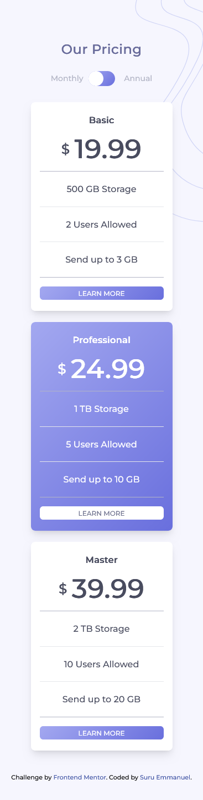
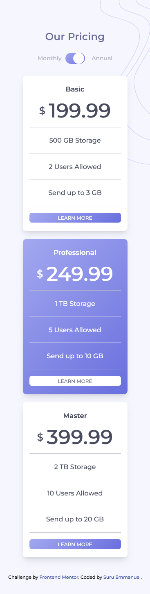
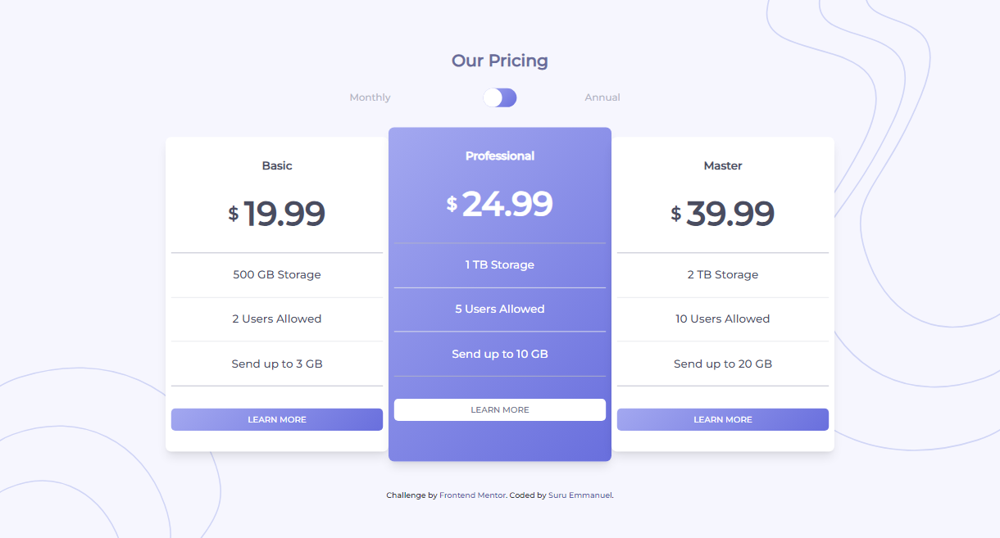
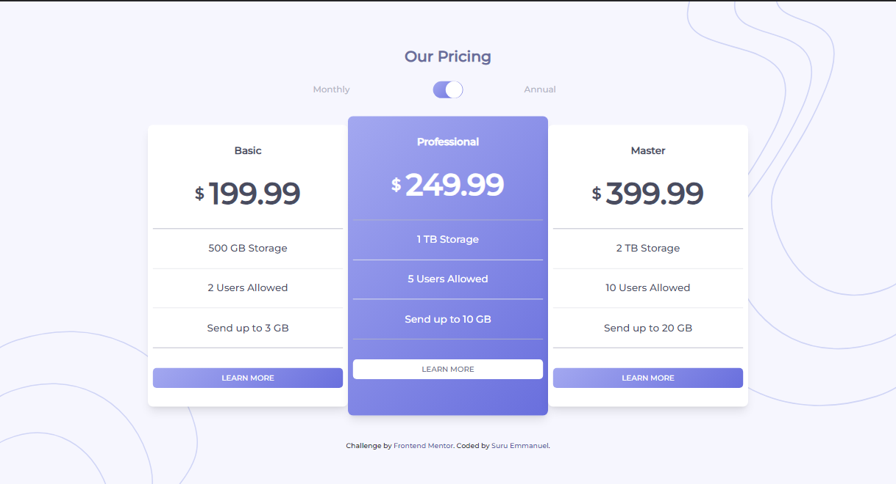

# Frontend Mentor - Pricing component with toggle solution

This is a solution to the [Pricing component with toggle challenge on Frontend Mentor](https://www.frontendmentor.io/challenges/pricing-component-with-toggle-8vPwRMIC).

## Table of contents

- [Overview](#overview)
  - [The challenge](#the-challenge)
  - [Screenshot](#screenshot)
  - [Links](#links)
- [My process](#my-process)
  - [Built with](#built-with)
  - [What I learned](#what-i-learned)
  - [Continued development](#continued-development)
  - [Useful resources](#useful-resources)
- [Author](#author)
- [Acknowledgments](#acknowledgments)

### Screenshot

### Links

- Solution URL:(https://github.com/suruaino/Challenge6.git)
- Live Site URL: (https://suru-pricing-component.netlify.app/)

## My process

### Built with

- Semantic HTML5 markup
- CSS custom properties
- Flexbox
- Mobile-first workflow
- [Tailwind](https://tailwindcss.com/)

### What I learned

Learned alot. More on flex-box and different positioning.

### Continued development
Will love to make more toggles with html and css only and know more about the proper ways of combining css selectors.

### Useful resources

- [Google](https://www.google.com) - Always my first option before requesting help from anybody. Its a good resource any coder.
- [Tailwind doc](https://www.tailwindcss/docs.com) - It is my most used resource. I only used others when a concept is confusing.
- [CHATGPT](https://chat.openai.com/) - This helped me many times when am lost. I really liked it and will will advice those who haven't tried it to please do.

## Author

- SURU EMMANUEL
- Frontend Mentor - [@suruaino](https://www.frontendmentor.io/profile/suruaino)
- Twitter - [@suruaino](https://www.twitter.com/suruaino)

## Acknowledgments

I will want to use this opportunity to thank my lovely sister Ojeifo Loveth and her husband Obende Daniel for their support and encouragement. They kept pushing me right from the day I started this journey till date. They never got tired. I want to say that I really appreciate.

